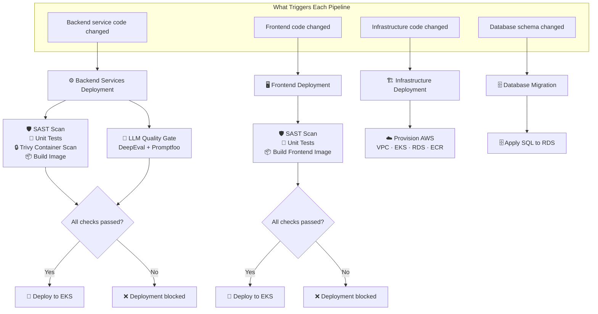
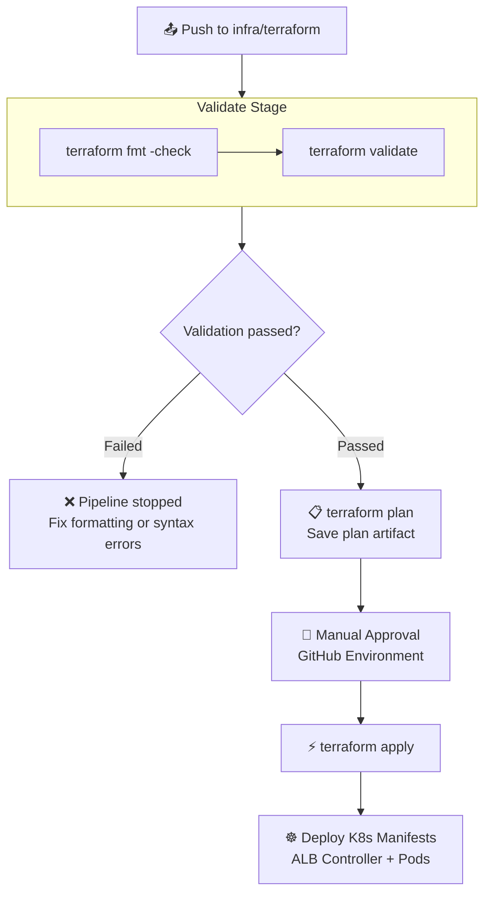
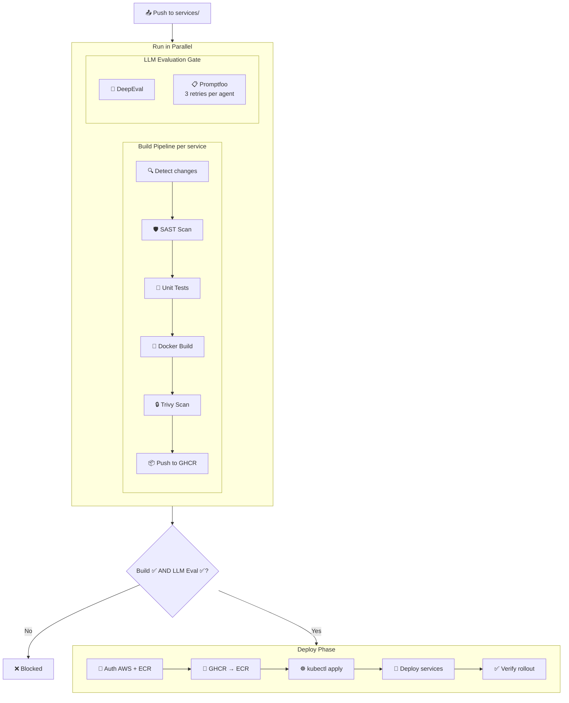
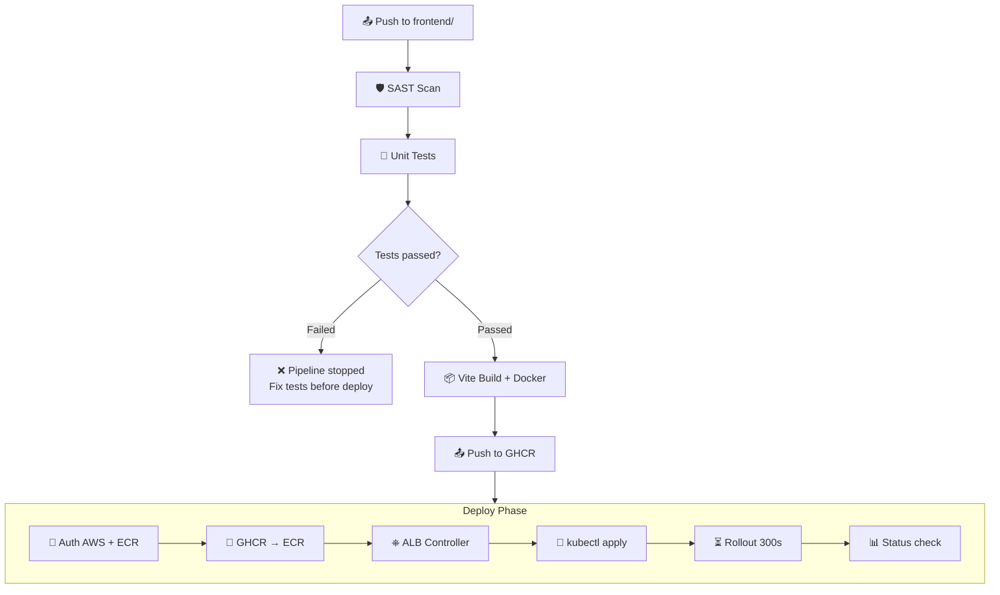
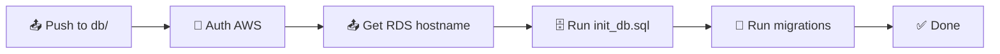

# LLMSecOps CI/CD Pipeline Report

## Introduction

This report documents the Continuous Integration and Continuous Deployment (CI/CD) pipeline architecture for the Agent-Based Hiring System. The system adopts an **LLMSecOps** approach — an extension of traditional DevSecOps that incorporates Large Language Model (LLM) quality evaluation as a mandatory gate in the deployment pipeline. This ensures that changes to AI agent prompts and logic are validated for correctness, relevancy, and hallucination resistance before reaching production.

The pipeline is implemented using **GitHub Actions** and deploys to **Amazon Web Services (AWS)** infrastructure managed by **Terraform**, with workloads running on **Amazon EKS (Elastic Kubernetes Service)**.

---

## 1. Master Pipeline Overview

The master pipeline overview illustrates how the four primary CI/CD pipelines are triggered by changes to different areas of the codebase. Each pipeline operates independently and is activated automatically when relevant files are pushed to the `main` branch.

The **Infrastructure Deployment** pipeline provisions and updates AWS cloud resources using Terraform. The **Backend Services Deployment** pipeline is the most complex — it runs two parallel validation tracks: a build pipeline (which includes SAST scanning, unit testing, and container vulnerability scanning) and an LLM quality evaluation gate. Deployment only proceeds when both tracks pass successfully. The **Frontend Deployment** pipeline follows a similar pattern with SAST scanning and unit testing before building the container image. The **Database Migration** pipeline applies SQL schema changes directly to the RDS PostgreSQL instance.

This architecture ensures that no code reaches the production environment without passing through multiple layers of automated validation, including security scanning, functional testing, and — uniquely for this LLM-based system — prompt quality evaluation.

---

## 2. Infrastructure Pipeline

The Infrastructure Pipeline manages all AWS cloud resources through a four-stage process following Infrastructure-as-Code (IaC) best practices.

**Stage 1 — Validation:** The pipeline begins with automated code quality checks. `terraform fmt -check` verifies that all Terraform files follow the standardised formatting convention, while `terraform validate` checks for syntax errors and internal consistency. If either check fails, the pipeline is immediately halted and the developer must resolve the issues before proceeding.

**Stage 2 — Plan:** Upon successful validation, `terraform plan` generates a detailed execution plan showing exactly which AWS resources will be created, modified, or destroyed. This plan is saved as an artifact for audit purposes and for use in the subsequent apply stage.

**Stage 3 — Manual Approval:** The plan is presented for human review via a GitHub Environment protection rule. A designated reviewer must examine the planned changes and explicitly approve the deployment. This prevents accidental or harmful infrastructure changes from being applied automatically.

**Stage 4 — Apply and Deploy:** After approval, `terraform apply` executes the plan to provision or update cloud resources (VPC, EKS cluster, RDS database, ECR repositories, NAT Gateway, and IAM roles). Once infrastructure is ready, the pipeline configures the AWS Load Balancer Controller via Helm and deploys all Kubernetes manifests — including service deployments, namespaces, secrets, and horizontal pod autoscalers.

---

## 3. Backend Services Pipeline

The Backend Services Pipeline is the core LLMSecOps pipeline, designed to validate both traditional software quality and AI-specific prompt quality before any deployment.

**Parallel Execution — Build Track:** When code changes are pushed to the `services/` directory, the pipeline first uses path-based change detection to identify which microservices were modified. For each changed service, it runs through a sequential build process: **SAST scanning** (static application security testing using Semgrep to identify security vulnerabilities in Python source code), **unit tests** (Python unittest framework to verify functional correctness), **Docker image building** (tagged with the Git commit SHA for immutable versioning), **Trivy container scanning** (checks the built image for CRITICAL-severity CVEs and blocks the pipeline if any are found), and finally pushes the scanned image to GitHub Container Registry (GHCR).

**Parallel Execution — LLM Evaluation Track:** Simultaneously, the LLM evaluation gate runs two complementary evaluation frameworks. **DeepEval** uses the `gpt-4o-mini` model to evaluate LLM outputs for hallucination and relevancy metrics. **Promptfoo** runs per-agent prompt regression tests for each AI agent (Resume Intake, Screening, Skill Assessment, and Audit agents), with a retry mechanism of up to 3 attempts to account for the non-deterministic nature of LLM responses.

**Deployment Gate:** Deployment is only permitted when **both** the build track and the LLM evaluation track pass successfully. If either track fails, deployment is blocked entirely. This dual-gate approach ensures that code changes which break functional tests, introduce security vulnerabilities, or degrade LLM output quality are caught before reaching the production environment.

**Deploy Phase:** Upon passing all gates, the pipeline authenticates with AWS, transfers the approved container images from GHCR to Amazon ECR, and applies the updated Kubernetes manifests using `kubectl`. This includes deploying Redis (the Celery message broker), the Celery background worker, MLflow (the experiment tracking server), and all AI agent services. Each deployment is verified with a rollout status check to confirm healthy pod startup.

---

## 4. Frontend Pipeline

The Frontend Pipeline handles the build and deployment of the React-based user interface.

**SAST Scan:** The pipeline begins with Semgrep static analysis targeting JavaScript and TypeScript security rules, identifying potential vulnerabilities such as cross-site scripting (XSS), insecure data handling, or dependency issues in the frontend codebase.

**Unit Tests:** After passing the SAST scan, the Vitest test framework executes the frontend unit test suite. If any tests fail, the pipeline is immediately halted and the developer receives clear feedback to fix the failing tests before deployment can proceed. This branching ensures that broken UI functionality is never shipped.

**Build and Package:** Upon passing all tests, the pipeline runs `npm ci` for reproducible dependency installation, executes a Vite production build to generate optimised static assets, and packages the output into a Docker container image using a multi-stage Dockerfile. The resulting image is pushed to GHCR with an immutable tag based on the Git commit SHA.

**Deploy Phase:** The deploy phase authenticates with AWS, transfers the image from GHCR to Amazon ECR, ensures the AWS Load Balancer Controller is installed and operational via Helm, and applies the frontend Kubernetes deployment manifest. The pipeline includes placeholder substitution for environment-specific values (AWS Account ID, region, ACM certificate ARN for HTTPS, and public subnet IDs for the load balancer). A rollout status check with a 300-second timeout confirms the deployment completed successfully, followed by a final status report showing pod health, services, and ingress configuration.

---

## 5. Database Migration Pipeline

The Database Migration Pipeline provides automated, repeatable schema management for the PostgreSQL database hosted on Amazon RDS.

When SQL files in the `db/` directory are pushed to the `main` branch, the pipeline authenticates with AWS and uses Terraform state to dynamically resolve the current RDS hostname — ensuring it always targets the correct database instance regardless of environment changes or infrastructure recreation.

The pipeline then executes two categories of SQL scripts sequentially. First, `init_db.sql` establishes the foundational database schema, creating tables, indexes, and constraints. This script is written to be idempotent (using `CREATE TABLE IF NOT EXISTS` patterns), making it safe to re-run on every deployment. Second, the pipeline iterates through all migration scripts in the `db/migrations/` directory in alphabetical order, applying incremental schema changes. Each script runs with `ON_ERROR_STOP=1`, ensuring that any SQL error immediately halts execution to prevent partial migrations that could leave the database in an inconsistent state.

---

## 6. Security Controls Summary

| Layer | Tool | What it checks | Blocks deploy? |
|---|---|---|---|
| **SAST** | Semgrep | Python (backend), JS/TS (frontend) | ✅ Yes |
| **Unit Tests** | unittest / Vitest | Per-service test suites | ✅ Yes |
| **Container Scan** | Trivy | CRITICAL CVEs in Docker images | ✅ Yes |
| **LLM Quality** | DeepEval | Hallucination and relevancy | ✅ Yes |
| **LLM Regression** | Promptfoo | Per-agent prompt tests, 3 retries | ✅ Yes |
| **Infra Approval** | GitHub Environments | Manual approval before apply | ✅ Yes |
| **Secrets** | K8s Secrets | Base64-encoded at deploy time | — |
| **Network** | Private Subnets | Egress via NAT Gateway only | — |

The pipeline implements a defence-in-depth security strategy across six blocking controls and two passive controls. The first three controls (SAST, unit tests, and container scanning) address traditional software security concerns. The next two controls (DeepEval and Promptfoo) are specific to LLM-based applications, validating that AI agent outputs maintain quality standards. Infrastructure changes require manual human approval, providing a final safeguard against accidental or malicious resource modifications. Secrets are never stored in code repositories — they are injected at deploy time from GitHub Secrets and base64-encoded into Kubernetes Secret objects. All application pods run in private subnets with no direct internet access, routing outbound traffic exclusively through the NAT Gateway.

---

## 7. Trigger Matrix

| Pipeline | Triggered by push to | Manual trigger |
|---|---|---|
| Infrastructure | `infra/terraform/**` | ✅ |
| Backend Services | `services/**` | ✅ |
| Frontend | `frontend/**` | ✅ |
| Database | `db/**` | ✅ |

All four pipelines support both automated triggers (on push to their respective directories) and manual dispatch through the GitHub Actions interface. This dual-trigger approach allows for both continuous deployment workflows and on-demand deployments for hotfixes or manual rollouts.

---

## 8. Required Secrets

| Secret | Purpose |
|---|---|
| `AWS_ACCESS_KEY_ID` / `AWS_SECRET_ACCESS_KEY` | AWS API authentication for Terraform and kubectl |
| `TF_VAR_DB_PASSWORD` | RDS PostgreSQL database password |
| `OPENAI_API_KEY` | LLM evaluation tests and agent runtime API access |
| `GITHUB_TOKEN` | Push and pull container images from GHCR |

These secrets are configured at the GitHub repository level under **Settings → Secrets and Variables → Actions** and are injected into workflow runs as environment variables. They are never logged or exposed in pipeline output.
