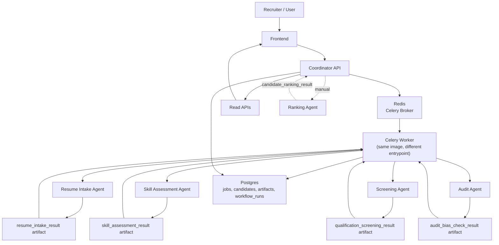

# System Workflow

This document describes the workflow implemented in the current codebase.

## 1. Workflow Summary

The main persisted workflow has two entry modes:

1. `POST /jobs` runs a single candidate workflow immediately.
2. `POST /candidates/upload` and `POST /candidates/batch-upload` parse resume files, dispatch Celery tasks via Redis, and return `202 Accepted`.
3. A Celery worker (separate container) picks up tasks from Redis, upserts the job, creates the candidate, and starts a workflow run.
4. The coordinator sends resume data to the Resume Intake Agent.
5. The Resume Intake Agent returns a structured candidate profile artifact.
6. The coordinator sends the parsed profile plus job context to the Skill Assessment Agent.
7. The Skill Assessment Agent returns a competency and gap-analysis artifact with `skills_score`.
8. The coordinator sends the parsed profile plus job context, along with the skill artifact, to the Screening Agent.
9. The Screening Agent returns qualification scores, recommendation signals, and review flags.
10. The coordinator builds an audit payload from current stats, candidates, decisions, and the latest screening result.
11. The coordinator sends that payload to the Audit Agent.
12. The Audit Agent returns an audit artifact with risk and review signals.
13. The coordinator persists all artifacts, updates candidate scores and review state, and marks the workflow run as completed.
14. The frontend reads jobs, candidates, stats, decision history, handoff traces, and audit output from the coordinator.

The Ranking Agent is separate from this default flow. It is invoked manually through `POST /jobs/{job_id}/rank`.

## 2. Workflow Diagram

## 3. Entry Points

### `POST /jobs/create`

This endpoint creates or updates job metadata only. It does not enqueue or run a candidate workflow.

### `POST /jobs`

This endpoint is not just job creation. It immediately starts a full workflow run for one candidate input.

Required request fields:

- `job_id`
- `resume_url`
- `job_description`

Optional request fields:

- `resume_text`
- `required_skills`
- `preferred_skills`
- `min_years_experience`
- `education_level`

### `POST /candidates/upload`

Uploads one file for an existing job, parses it in the coordinator, enqueues a workflow job, and returns `202 Accepted`:

- query param: `job_id`
- multipart field: `file`

### `POST /candidates/batch-upload`

Uploads multiple files for an existing job, parses them in the coordinator, enqueues workflow jobs, and returns `202 Accepted`:

- query param: `job_id`
- multipart field: `files`

Supported upload types:

- `.txt`
- `.pdf`
- `.docx`

### `GET /jobs/{job_id}/handoffs`

Returns a derived handoff trace built from the persisted workflow artifacts for a job.

## 4. Step-By-Step Flow

### Step 1: Job context is prepared

The coordinator either:

- uses the job data sent to `POST /jobs`, or
- looks up the existing job before processing queued uploaded resumes.

When listing jobs back to the frontend, the coordinator returns normalized fields such as:

- `title`
- `job_description`
- `required_skills`
- `preferred_skills`
- `min_years_experience`
- `education_level`
- `candidates_count`

If explicit `required_skills` are not stored, the coordinator derives a small skill list from the job description.

### Step 2: Resume text is extracted

For upload endpoints, the coordinator extracts text before calling the agents:

- TXT is decoded directly.
- PDF uses `pypdf`.
- DOCX uses `python-docx`.

Unsupported formats return `415`, and empty or unreadable files return structured parsing errors.

### Step 3: Workflow state is bootstrapped

Before the first agent call, the coordinator:

- upserts the job row
- creates the candidate row
- starts a `workflow_runs` row
- generates a shared `correlation_id`

This makes failures traceable from the first step.

### Step 4: Resume Intake Agent

Input:

- `resume_url`
- `resume_text`
- `job_description`

Output artifact:

- type: `resume_intake_result`
- payload includes normalized candidate fields such as `name`, `email`, `skills`, and `status`

Execution mode:

- OpenAI-backed when configured
- heuristic fallback otherwise

### Step 5: Skill Assessment Agent

Input:

- parsed resume payload from intake
- `resume_text`
- `job_description`
- structured `job_requirements`

Output artifact:

- type: `skill_assessment_result`
- payload includes:
  - `skills_score`
  - `matched_required_skills`
  - `matched_preferred_skills`
  - `missing_required_skills`
  - `missing_preferred_skills`
  - `detected_soft_skills`
  - `strengths`
  - `gaps`
  - `gap_analysis`

Execution mode:

- OpenAI-backed when configured
- heuristic fallback otherwise

### Step 6: Screening Agent

Input:

- parsed resume payload from intake
- skill assessment payload from the previous step
- `job_description`
- structured `job_requirements`

Output artifact:

- type: `qualification_screening_result`
- payload includes:
  - `qualification_score`
  - `meets_threshold`
  - `matched_skills`
  - `missing_skills`
  - `decision`
  - `needs_human_review`
  - `review_reasons`

Review flags are raised when the result is borderline, low-confidence, or produced through heuristic fallback.

### Step 7: Audit Agent

The coordinator builds audit input from:

- current job stats
- current candidate list
- persisted decision artifacts
- the latest screening result

Output artifact:

- type: `audit_bias_check_result`
- payload includes:
  - `selection_rate`
  - `bias_flags`
  - `risk_level`
  - `review_required`
  - `recommendations`

### Step 8: Candidate completion and review state

After audit completes, the coordinator:

- persists intake, skill assessment, screening, and audit artifacts
- takes `skills_score` from the skill assessment artifact
- computes `composite_score`
- updates candidate `status` and `recommendation`
- combines screening and audit review signals into:
  - `needs_human_review`
  - `review_status`
  - `review_reasons`
  - `escalation_source`
- marks the workflow run as `COMPLETED`
- marks the job as `COMPLETED`

Default coordinator status mapping from screening:

- `meets_threshold = true` -> `SHORTLIST` / `shortlisted`
- `meets_threshold = false` -> `REJECT` / `rejected`

### Step 9: Manual ranking

When `POST /jobs/{job_id}/rank` is called, the coordinator:

- fetches all candidates for the job
- sends them to the Ranking Agent
- stores manual ranking metadata back onto candidate rows

The ranking agent is currently heuristic, but it does not overwrite screening/audit decisions or candidate composite scores.

## 5. Data Model

The main persisted tables are:

- `jobs`
- `candidates`
- `workflow_runs`
- `artifacts`

Relevant schema additions in the current migration set:

- `jobs.job_requirements`
- `candidates.needs_human_review`
- `candidates.review_status`
- `candidates.review_reasons`
- `candidates.escalation_source`
- `candidates.rank_position`
- `candidates.ranking_score`
- `candidates.ranking_method`

## 6. Frontend Reality Check

The dashboard is wired to coordinator read APIs for:

- jobs
- candidates
- candidate decision trails
- stats
- agent health
- audit bias checks

The frontend connects to the coordinator WebSocket endpoint at `/ws` for live activity updates while uploads are processing.
