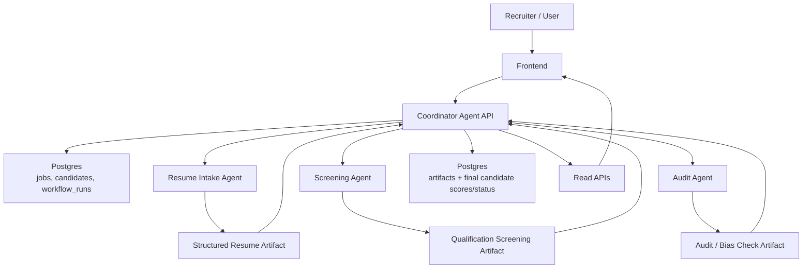

# System Workflow

This document describes the current workflow of the Agent-Based Hiring System based on the implemented code and the original project proposal.

## 1. Current Workflow Summary

The current end-to-end system processes a candidate through these main stages:

1. A job is created or selected in the frontend.
2. One or more resumes are uploaded to the coordinator API.
3. The coordinator creates database records for the job, candidate, and workflow run.
4. The coordinator sends the resume to the Resume Intake Agent.
5. The Resume Intake Agent extracts structured candidate data.
6. The coordinator sends the parsed profile to the Screening Agent.
7. The Screening Agent evaluates qualifications and decides whether the candidate meets the threshold.
8. The coordinator sends job-level statistics, candidate state, and decision trail data to the Audit Agent.
9. The Audit Agent returns a bias/risk review artifact.
10. The coordinator persists all artifacts, updates candidate scores/status, and marks the workflow as completed.
11. The frontend reads candidates, scores, stats, and decision history from the coordinator's read APIs.

## 2. Workflow Diagram

## 3. Step-by-Step Flow

### Step 1: Job creation or selection

- The frontend loads existing jobs from `GET /api/jobs`.
- A new job can be submitted through `POST /api/jobs`.
- In the current implementation, the sample frontend job creation sends a minimal job payload and starts a workflow immediately.

### Step 2: Resume upload

- Users upload one or more files from the dashboard.
- The frontend sends files to:
  - `POST /api/candidates/upload`
  - `POST /api/candidates/batch-upload`
- The coordinator reads the file bytes, converts them into plain text, and attaches that text to the workflow request.

### Step 3: Coordinator bootstraps workflow state

Before calling any sub-agent, the coordinator:

- upserts the job record,
- creates a candidate record,
- starts a `workflow_runs` record,
- generates a shared `correlation_id` for traceability.

This makes the run auditable from the start, even if a later step fails.

### Step 4: Resume Intake Agent

The Resume Intake Agent receives:

- `resume_url`
- `resume_text`
- `job_description`

Its role is to convert the raw resume input into a structured candidate profile, including:

- candidate name
- email
- skills
- years of experience
- summary

Processing mode:

- If OpenAI is configured, the agent attempts model-based parsing.
- If not, it falls back to heuristic extraction.

Output:

- artifact type: `resume_intake_result`
- stored as an artifact in Postgres

### Step 5: Screening Agent

The coordinator sends the parsed resume plus job context to the Screening Agent.

Inputs include:

- parsed resume payload from intake
- job description
- structured job requirements:
  - required skills
  - preferred skills
  - minimum years of experience
  - education level

The Screening Agent:

- calculates a qualification score,
- determines matched and missing skills,
- decides whether the candidate meets the threshold,
- flags borderline or low-confidence cases for possible human review,
- produces a natural-language explanation.

Processing mode:

- LLM-first when available
- heuristic fallback otherwise

Output:

- artifact type: `qualification_screening_result`
- candidate decision such as `PASS` or `FAIL`
- review metadata such as `needs_human_review`

### Step 6: Audit Agent

After screening, the coordinator builds an audit input using:

- current job statistics,
- current candidate list,
- existing decision artifacts,
- the latest screening outcome.

The Audit Agent evaluates:

- selection rate,
- possible bias flags,
- risk level,
- whether review is required,
- audit recommendations.

Output:

- artifact type: `audit_bias_check_result`
- stored as an artifact in Postgres

### Step 7: Final persistence and status update

When all three agent calls succeed, the coordinator:

- saves every agent artifact,
- computes `skills_score`,
- computes `composite_score`,
- updates the candidate status and recommendation,
- marks the workflow run as `COMPLETED`,
- marks the job as `COMPLETED`.

Current status mapping:

- shortlisted candidates become `SHORTLIST`
- failed candidates become `REJECT`

### Step 8: Frontend read and explanation layer

The frontend then reads system state from coordinator APIs, including:

- jobs list
- candidate list
- candidate details
- decision trail
- aggregate stats
- agent health
- audit bias check

This is how the current system exposes explainability:

- per-candidate scores,
- agent explanations,
- confidence values,
- ordered decision history from stored artifacts.

## 4. Data Stored in the System

The workflow persists traceable records in Postgres across these main tables:

- `jobs`
- `candidates`
- `workflow_runs`
- `artifacts`

This supports:

- replaying workflow outcomes,
- viewing candidate decision history,
- computing dashboard statistics,
- reviewing agent-generated explanations later.

## 5. Mapping to the Proposal

The proposal describes five core agent roles:

1. Coordinator Agent
2. Resume Intake Agent
3. Qualification Screening Agent
4. Skill Assessment / Ranking & Recommendation Agent
5. Explanation & Audit Agent

### Already implemented as working services

- Coordinator Agent
- Resume Intake Agent
- Qualification Screening Agent
- Audit Agent

### Partially implemented or merged into existing logic

- Ranking is currently implemented inside the coordinator repository logic through `POST /jobs/{job_id}/rank`, not as a separate ranking agent service.
- Skill assessment is not yet a standalone service; parts of skill matching are currently handled inside the Screening Agent and final score computation.
- Explainability is already present through saved artifacts and candidate decision trails in the frontend.

### Not yet fully aligned with the proposal

- No separate Skill Assessment Agent service
- No separate Ranking & Recommendation Agent service
- No robust PDF/DOCX/OCR extraction pipeline yet
- No external ATS, LinkedIn, or calendar integration yet
- Human-in-the-loop escalation exists as metadata (`needs_human_review`) but is not yet a full review workflow

## 6. Important Current Limitations

- Uploaded files are currently converted into text in a basic way, so rich parsing for PDF/DOCX/scanned resumes is still limited.
- The UI presents a multi-agent view that includes skills and ranking concepts, but the backend currently runs the concrete pipeline: intake -> screening -> audit.
- Ranking is database-driven after screening, rather than handled by a separate autonomous ranking service.
- Real model-backed runs depend on `OPENAI_API_KEY`; otherwise the system uses heuristic fallback logic.

## 7. Practical One-Line Workflow

In the current implementation, the system workflow is:

`Frontend -> Coordinator -> Resume Intake Agent -> Screening Agent -> Audit Agent -> Postgres -> Frontend Dashboard`
