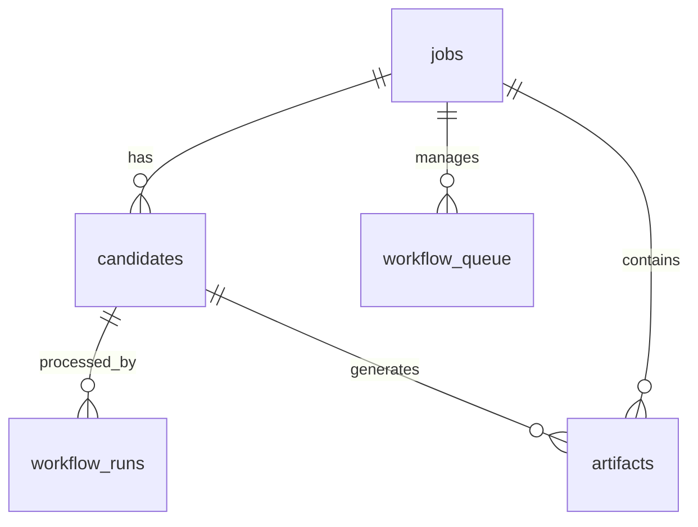

# Database Schema and Table Usage

This directory contains the database initialization scripts and migrations for the Agent-Based Hiring System. The system uses a PostgreSQL database to manage jobs, candidates, workflow states, and agent artifacts.

## Overview

The database is designed to support an asynchronous, multi-agent hiring pipeline. Only the **Coordinator Agent** interacts directly with the database, serving as the central "brain" that persists state and coordinates handoffs between specialized agents.

## Table List

### 1. `jobs`
Stores metadata and status for recruitment positions.
- **`job_id`**: Unique identifier for the job (e.g., "SE-2024").
- **`title`**: Job title.
- **`job_description`**: Raw text description.
- **`job_requirements`**: JSONB field containing required/preferred skills and experience.
- **`status`**: `PROCESSING`, `COMPLETED`, or `FAILED`.

### 2. `candidates`
Stores information about applicants and their current status in the pipeline.
- **`candidate_id`**: Unique UUID.
- **`job_id`**: Reference to the job.
- **`name`, `email`, `phone`**: Extracted contact details.
- **`resume_text`**: Parsed text from the uploaded resume.
- **`skills`**: JSONB list of extracted skills.
- **`status`**: Current recruitment status (e.g., `processing`, `shortlisted`, `rejected`).
- **`scores`**: Numerical scores from screening and skill assessment (`qualification_score`, `skills_score`, `composite_score`).
- **`ranking`**: Metadata from the ranking agent (`rank_position`, `ranking_score`, `ranking_method`).
- **`needs_human_review`**: Boolean flag for manual intervention.

### 3. `workflow_runs`
Tracks active and historical workflow execution for each candidate.
- **`run_id`**: Unique UUID.
- **`current_step`**: The active agent stage (e.g., `resume-intake`, `skill-assessment`, `screening`, `audit`).
- **`status`**: `RUNNING`, `COMPLETED`, or `FAILED`.
- **`last_error`**: Detailed error message if the run fails.

### 4. `artifacts`
Immutable log of all agent outputs generated during a workflow.
- **`artifact_type`**: Type of data (e.g., `resume_analysis`, `skill_match`, `audit_report`).
- **`payload`**: JSONB data containing the agent's full analysis.
- **`confidence`**: Score (0-1) indicating the agent's certainty.
- **`explanation`**: Natural language justification for the agent's findings.

### 5. `workflow_queue`
Manages asynchronous processing of uploaded resumes.
- **`status`**: `PENDING`, `RUNNING`, `COMPLETED`, or `FAILED`.
- **`request_payload`**: The original upload request data.

---

## Service Usage Mapping

Only the **Coordinator Agent** has direct database access. Other agents receive input data via API calls from the Coordinator and return results as JSON artifacts.

| Table | Service | Usage |
| :--- | :--- | :--- |
| `jobs` | `coordinator-agent` | Create/Update job metadata and aggregate stats. |
| `candidates` | `coordinator-agent` | Persist candidate state, contact info, and scores. |
| `workflow_runs` | `coordinator-agent` | Track pipeline state and handle failures. |
| `artifacts` | `coordinator-agent` | Store outputs from **all agents** (Intake, Screening, etc.). |
| `workflow_queue` | `coordinator-agent` | Background processing of file uploads. |

### Specialized Agent Contributions (via Artifacts)
While agents do not query the DB directly, they contribute to the following tables via the Coordinator:
- **Resume Intake Agent**: Provides data for `candidates.name/email` and `artifacts`.
- **Skill Assessment Agent**: Provides data for `candidates.skills_score` and `artifacts`.
- **Screening Agent**: Provides data for `candidates.qualification_score` and `artifacts`.
- **Ranking Agent**: Provides data for `candidates.rank_position` and `artifacts`.
- **Audit Agent**: Provides data for `artifacts` (bias checks and risk audits).

---

## Usage Illustration

### New Candidate Workflow
When a resume is uploaded, the Coordinator performs the following sequence:

1. **Enqueue**: Inserts a record into `workflow_queue`.
2. **Bootstrap**: A background worker claims the job, creates a `candidates` record, and starts a `workflow_runs` entry.
3. **Execution**:
   - Coordinator calls an agent (e.g., `screening-agent`).
   - Agent returns analysis.
   - Coordinator saves analysis to `artifacts`.
   - Coordinator updates `candidates` status and `workflow_runs` step.
4. **Completion**: Updates `jobs`, `candidates`, and `workflow_runs` to `COMPLETED`.

### Schema Relationships

